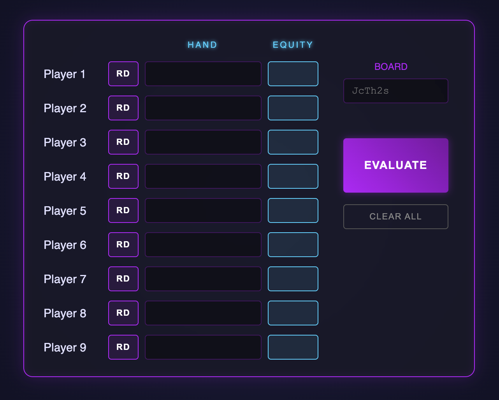

# Poker Equity Calculator

A high-performance, sleek poker equity calculator designed to help
players determine their win probability in real-time. This tool
supports up to 9 players.

[Try it here](https://arkvis.com/poker-equity/)

## 📸 Preview

   

## ✨ Features

* **Multi-Player Support:** Calculate equity for 2 to 9 players simultaneously.
* **Dynamic Board Input:** Input Flop, Turn, and River cards to see how equity shifts across different streets.
* **Random Hand Generation:** Use the **RD** button to quickly assign random hands to players for situational testing.
* **Modern Dark UI:** A neon-accented, high-contrast interface designed for clarity during long study sessions.
* **Instant Evaluation:** Fast processing of hand matchups to provide win/tie percentages (equity) instantly.

## 🚀 How to Use

1. **Enter Hands:** Type the specific hole cards for each player in the "HAND" column (e.g., `AhAd`, `KsQh`).
2. **Randomize (Optional):** Click the **RD** button next to a player to assign a random range.
3. **Set the Board:** Enter the community cards in the "BOARD" section (e.g., `JcTh2s`).
4. **Evaluate:** Click the large **EVALUATE** button to run the simulation.
5. **View Results:** Equity percentages will appear in the blue "EQUITY" column for each active player.
6. **Reset:** Use **CLEAR ALL** to wipe the board and hands for a new session.

## 🛠 Tech Stack

* **Frontend:** Pure HTML, CSS, and Javascript
